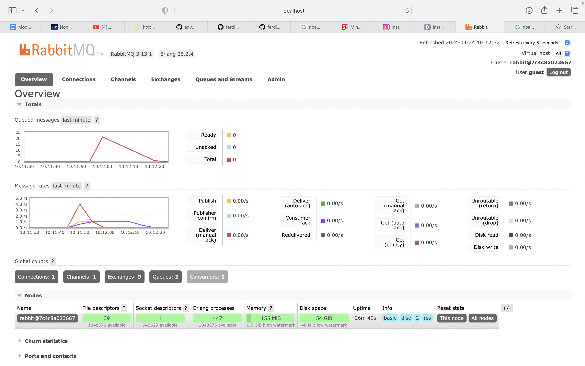
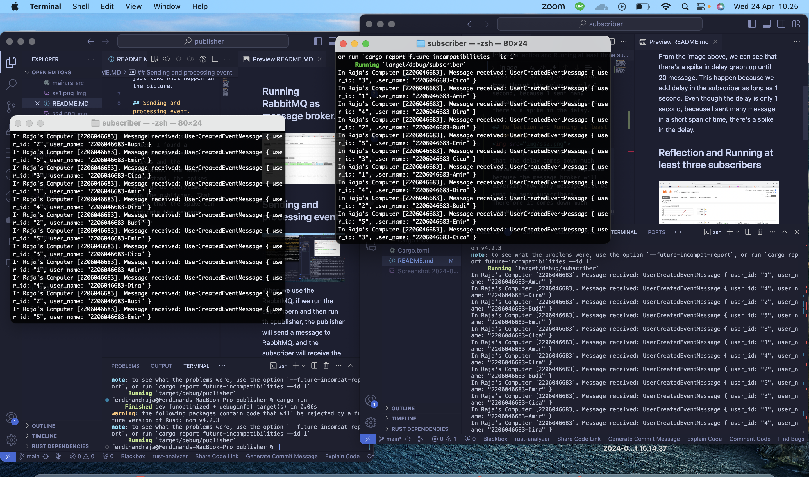
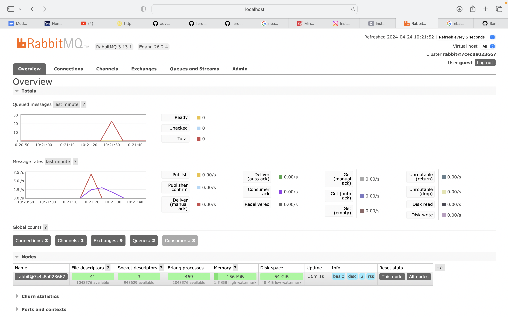

## what is amqp?
AMQP, or Advanced Message Queuing Protocol (AMQP), is a network communication protocol used to send messages between different applications. AMQP supports programming load balancing and monitoring by separating exchanges and queues.

## what it means? guest:guest@localhost:5672 , what is the first quest, and what is the second guest, and what is localhost:5672 is for?
The link is the URL that connects into AMQP server.
- The first guest is the username for RabbitMQ
- The secon guest is the password for RabbitMQ authentication
- The `localhost:5672` means that the AMQP server will run in locals and it will use port 5672 as the port to receive connection

## Simulation slow subscriber

From the image above, we can see that there's a spike in delay graph up until 20 message. This happen because we add delay in the subscriber as long as 1 second. Even though the delay is only 1 second, because I sent many message in a short span of time, there's a spike in the delay.

## Reflection and Running at least three subscribers
### Three subscribers

From the picture above, we can see that the delay comes down much faster than before. This happened because the message broker will diversify how many message will be sent to many subscribers. Therefore it comes down much faster than before